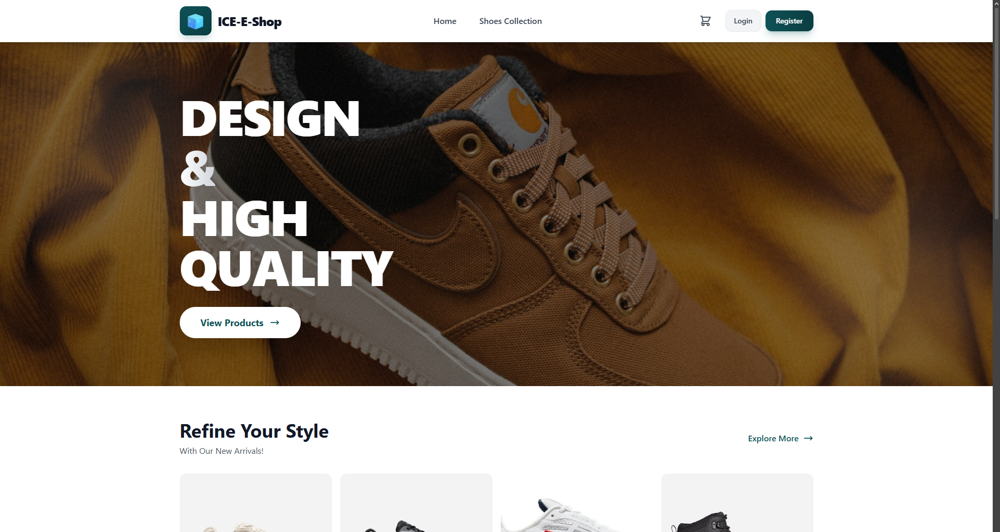
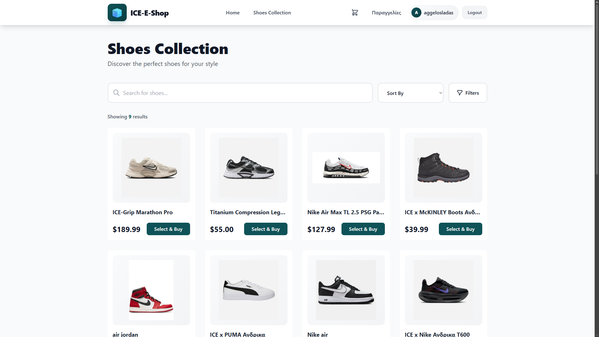
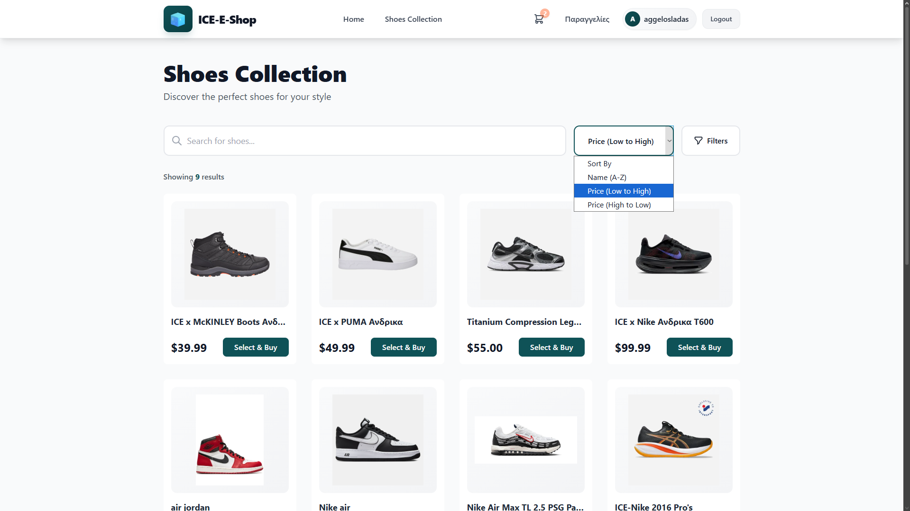
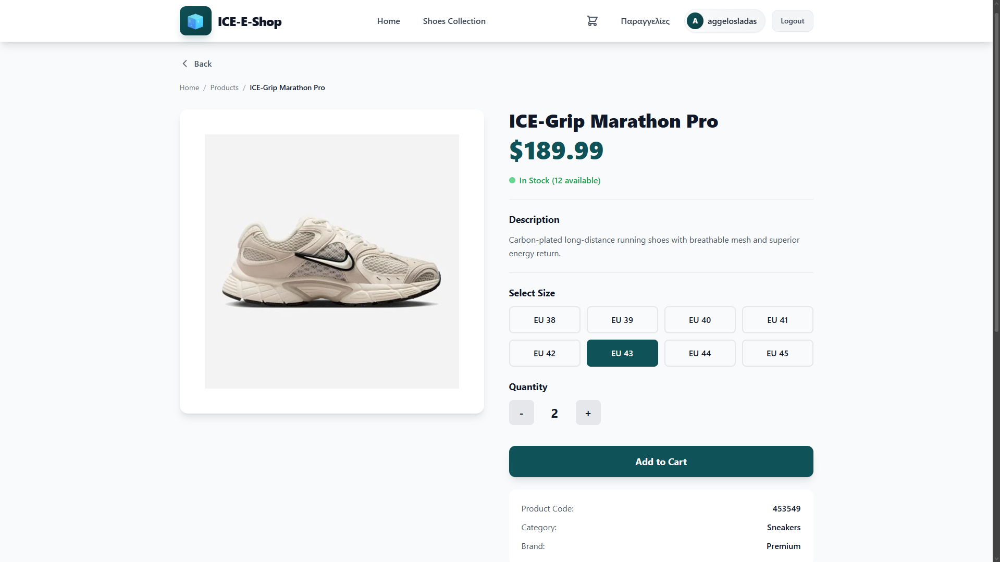
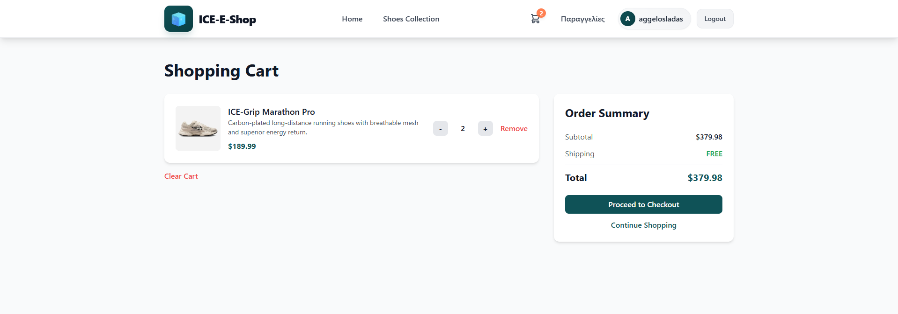
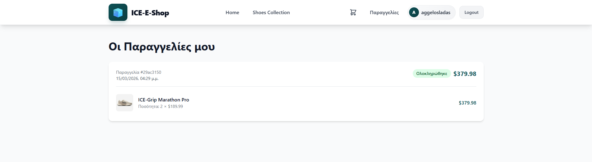

# ICE E-Shop

A full-stack e-commerce application built with Spring Boot and a modern frontend. The project is fully containerized using Docker and designed to be straightforward to spin up locally or on any server.

**Backend** &nbsp;&middot;&nbsp; Aggelos Ladas &nbsp;&nbsp; [](https://aggelosladas.github.io/CV/) [](https://www.linkedin.com/in/aggelos-ladas-9057b1196/)  

**Frontend** &nbsp;&middot;&nbsp; Stefanos Souroullas

---

## Screenshots of Demo

<table>
  <tr>
    <td valign="top" width="50%">
      <h3 align="center">Launch Screen</h3>
      
    </td>
    <td valign="top" width="50%">
      <h3 align="center">Product Catalog</h3>
      
    </td>
  </tr>
  <tr>
    <td valign="top" width="50%">
      <h3 align="center">Filtering</h3>
      
    </td>
    <td valign="top" width="50%">
      <h3 align="center">Item Details & Quantity</h3>
      
    </td>
  </tr>
  <tr>
    <td valign="top" width="50%">
      <h3 align="center">Shopping Cart</h3>
      
    </td>
    <td valign="top" width="50%">
      <h3 align="center">Order History</h3>
      
    </td>
  </tr>
</table>

---

## Tech Stack

### Backend
- **Spring Boot** — Core framework
- **Hibernate / JPA** — ORM for database interaction
- **MySQL** — relational database (tested with [Aiven](https://aiven.io/) cloud MySQL)
- **JWT** — stateless authentication
- **MVC Structure** — clean separation between controllers, services, and repositories
- **Dependency Injection** — managed via Spring's IoC container (Field Injection + Constructor Injection)
- **Swagger UI** — auto-generated API docs available at `http://localhost:8080/swagger-ui/index.html`

### Frontend
- Containerized and served on port `3000`
- See the frontend directory for stack details

---

## Project Structure

```
├── backend/
│   ├── Dockerfile
│   ├── .env.example
│   └── ...
├── frontend/
│   ├── Dockerfile
│   └── ...
└── images/
    └── Screenshot_*.png
```

---

## Running the Project

### Prerequisites
- Docker installed and running
- A MySQL database (local or cloud — Aiven works great and has a *VERY* generous free tier of 1GB)

---

### Backend

**1. Set up your environment file**

Copy the provided example and fill in your own values:

```bash
cp .env.example .env
```

Open `.env` and plug in your MySQL credentials:

```env
DB_URL=jdbc:mysql://<your-host>:<port>/<db-name>
DB_USERNAME=your_username
DB_PASSWORD=your_password
JWT_SECRET=your_jwt_secret
```

> If you're using Aiven, grab the connection details from your Aiven console. Make sure SSL is configured if required.

**2. Build the Docker image**

```bash
cd backend
docker build -t my-backend .
```

**3. Run the container with your .env injected**

```bash
docker run -p 8080:8080 --env-file ../.env my-backend
```

The API will be live at `http://localhost:8080`  
Swagger docs at `http://localhost:8080/swagger-ui/index.html`

---

### Frontend

**1. Build the Docker image**

```bash
cd frontend
docker build -t my-frontend .
```

**2. Run the container**

```bash
docker run -p 3000:3000 my-frontend
```

The app will be available at `http://localhost:3000`

---

## API Documentation

Once the backend is running, the full API is documented and explorable via Swagger UI:

```
http://localhost:8080/swagger-ui/index.html
```

All endpoints, request bodies, and responses are documented there — no Postman collection needed.

---

## Authentication

The API uses **JWT-based authentication**. After logging in, include the token in the `Authorization` header for protected routes:

```
Authorization: Bearer <your_token>
```

---
